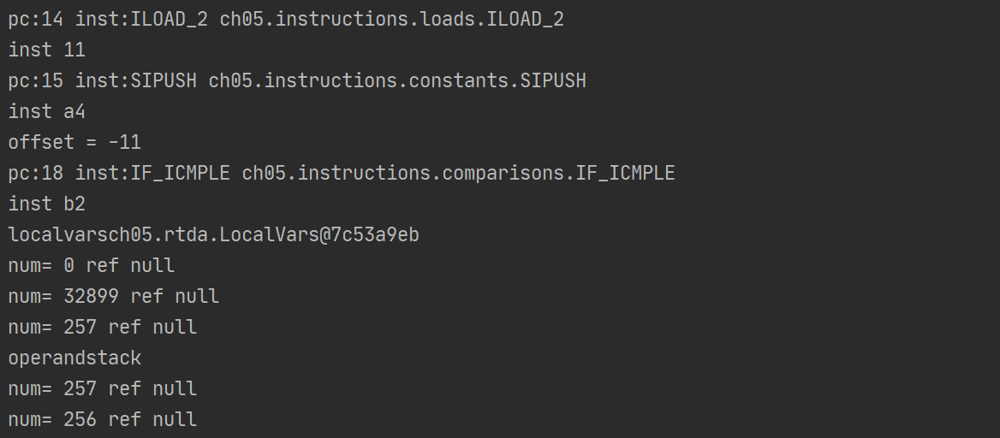

#### 用Java实现的Java解释器（参考《自己动手写Java虚拟机》）

#### ch01命令行工具
通过命令行读取class、设置Jre、Classpath、help
```java
Options options = new Options();

options.addOption("h", "help", false, "print help message");
options.addOption("v", "version", false, "print version and exit");
options.addOption("cp", "classpath", true, "");
options.addOption("X", "Xjre", true, "Jar path");
```
运行实例
```java
String[] cmdArgs = {"java", "-cp", D:\\path", "ch02.cmdparse.Parser"};
```
#### ch02查找class文件
从zip、jar、class文件、路径中搜索并加载指定class
运行实例
```java
-classpath/-cp选项既可以指定目录，也可以指定JAR文件或者ZIP文件，如下：
java -cp D:\\path\to\classes  Test
java -cp D:\\path\to\lib.jar Test
java -cp D:\\path\tp\lib.zip Test
java -cp D:\\path\to\classes;lib\a.jar;lib\c.zip Test
```
### ch03解析class文件
解析class文件
解析magicnumber，minorVersion，majorVersion，常量池，类访问标志，类名，超类，（接口），字段，属性表
```java
String[] cmdArgs = {"java", "-cp", D:\\path", "ch03/8.cmdparse.Parser"};
```


#### ch04创建JVM数据结构
创建栈帧（局部变量表，操作数栈）

#### ch05指令集和解释器
编写指令集：
```java
base：DREM，FREM，IREM，LREM，WIDE
comparisons：DCMPG，DCMPL，FCMPG，FCMPL，IF_ICMPEQ，IF_ICMPGE，IF_ICMPGT，IF_ICMPLE，
            IF_ICMPLT，IF_ICMPNE，IFEQ，IFGE，IFGT，IFLE，IFLT，IFNE，LCMP
constants：BIPUSH，DCONST_0，DCONST_1，FCONST_0，FCONST_1，F_CONST_2，ICONST_0，
            ICONST_1，ICONST_2，ICONST_3，ICONST_4，ICONST_5，ICONST_M1,LCONST_0，LCONST_1，NOP，SIPUSH
control：GOTO，LOOKUP_SWITCH，TABLE_SWITCH
conversions：D2F，D2I，D2L，IF_ACMPEN，IF_ACMPEQ
extended：GOTO_W，IFNOTNULL，IFNULL
loads：ILOAD，ILOAD_0，ILOAD_2，ILOAD_3
math：IADD，IAND，IINC，IOR，ISHL，ISHR，IUSHR，IXOR，LADD，LAND，LOR，LSHL，LSHR，LUSHR，LXOR
stack：DUP，POP，POP2，SWAP
stores：ISTORE，ISTORE_0，ISTORE_1，ISTORE_2，ISTORE_3
```
测试整数运算（源代码）

运行结果：32899

